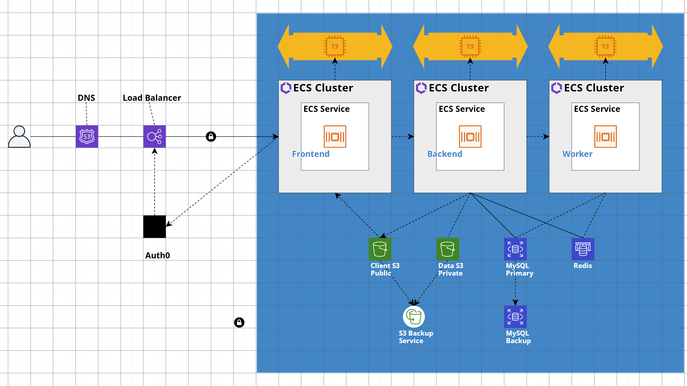

# GCAPI Application

 

- [GCAPI Application](#gcapi-application)
  - [Application Infrastructure](#application-infrastructure)
    - [Application Services](#application-services)
  - [Development Technology Stack](#development-technology-stack)
    - [Software and Programming Languages](#software-and-programming-languages)
  - [Additional Resources](#additional-resources)
  - [Backend Documentation](#backend-documentation)
  - [Frontend Documentation](#frontend-documentation)
  - [End-to-End Testing](#end-to-end-testing)

## Application Infrastructure

### Application Services

- Route 53 / Cloudflare DNS service
- Application Load Balancer
- Auth0 Authentication Server Instance
- EC2 Server Instances (x3)
  - Frontend Web Application
  - Backend API
  - Backend Worker
- S3 Bucket Instance (x2 @100GB)
  - S3 Backup Service
- AWS Relational Database Service (RDS) MySQL/Postgres instance
  - AWS RDS database instance backup service
- ElastiCache Redis instance

## Development Technology Stack

### Software and Programming Languages

- Linux / Ubuntu
- DNS Routing: [AWS Route 53](https://aws.amazon.com/route53/) / [Cloudflare](https://www.cloudflare.com/)
- [MySQL](https://www.mysql.com/)
  - [DBML](https://dbml.dbdiagram.io/home/#intro)
- [Redis](https://redis.io/) / [Redis Enterprise Cloud](https://redis.com/redis-enterprise-cloud/)
- [Python 3](https://www.python.org/)
  - [Poetry](https://python-poetry.org/) package manager
  - [Alembic](https://alembic.sqlalchemy.org/en/latest/) for database migrations
  - [SqlAlchemy](https://docs.sqlalchemy.org/en/20/) for database ORM and transactions
    - [Ex. FastAPI SQLAlchemy Async DB Config](https://rogulski.it/blog/fastapi-async-db/)
  - [Pydantic](https://docs.pydantic.dev/latest/) for data validation
  - [Celery](https://docs.celeryq.dev/en/stable/index.html) workers for
  processing tasks in the queue
  - [FastAPI](https://fastapi.tiangolo.com/) for the API layer
    - [Security](https://fastapi.tiangolo.com/tutorial/security/)
    - [OAuth2](https://fastapi.tiangolo.com/tutorial/security/oauth2-jwt/)
      - [Ex. Auth0 Scope Based Access Control](https://github.com/auth0-developer-hub/api_fastapi_python_hello-world/tree/basic-role-based-access-control)
      - [Ex. FastAPI-Auth0 Package](https://github.com/dorinclisu/fastapi-auth0)
    - [Resource Level Access Control](https://github.com/holgi/fastapi-permissions/blob/master/README.md)
    - [Ex. Full-Stack Template by @Tiangolo](https://github.com/tiangolo/full-stack-fastapi-postgresql/blob/master/%7B%7Bcookiecutter.project_slug%7D%7D/README.md)
- [Node / NPM](https://www.npmjs.com/) package manager
- [Typescript](https://www.typescriptlang.org/)
  - [SolidJS](https://www.solidjs.com/)
  - [Solid-Start](https://start.solidjs.com/getting-started/what-is-solidstart)
- [OpenAPI Frontend Client Generation](https://fastapi.tiangolo.com/advanced/generate-clients/)
  - [OpenAPI Typescript Code Generator](https://github.com/ferdikoomen/openapi-typescript-codegen)

## Additional Resources

- [CloudCraft AWS Service Diagrams & Cost Estimates](https://www.cloudcraft.co/)
- [AWS Getting Started: Creating A MySQL Database](https://aws.amazon.com/getting-started/hands-on/create-mysql-db/)
- [Stackify: Getting Started with AWS Lambda with Python](https://stackify.com/aws-lambda-with-python-a-complete-getting-started-guide/)
- [AmazonS3AWS S3 CloudFront Route53 Video Streaming](https://docs.aws.amazon.com/AmazonS3/latest/userguide/tutorial-s3-cloudfront-route53-video-streaming.html)

## Backend Documentation

- [GCAPI-backend](https://github.com/joeygrable94/GCAPI-backend)

## Frontend Documentation

- [GCAPI-frontend](https://github.com/joeygrable94/GCAPI-frontend)

## End-to-End Testing

- CI/CD pipeline...
