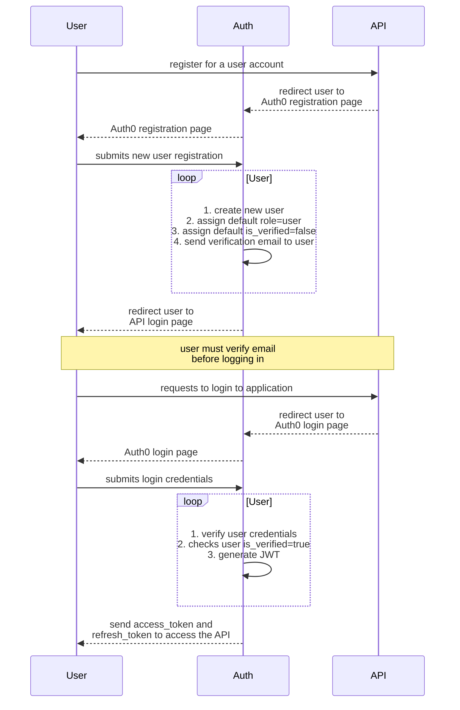
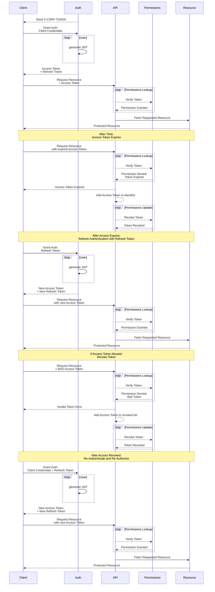

# GCAPI Security

To ensure data privacy and security, strict restrictions are placed on user
access. Key challenges include authentication, authorization, and protection
against malicious attacks.

## User Authentication

Authentication involves verifying user identity using established industry
standards. Auth0 by Okta, based on OAuth2.0, is recommended for secure
authentication. It allows multi-platform login options and role-based
permissions assignment.

### Authentication Flow

The authentication flow consists of three primary steps:

1. Users register through the Auth0 registration page using a valid email
address.
2. Users verify their email address before logging in and accessing the API.
3. Users are initially assigned the "user" role and must be granted additional
privileges by an admin.



## User Authorization

Authorization determines user privileges based on defined permissions for
specific data resources. Clear data permissions and rules for granting access
are crucial for data security.

### Resource Data Models and Relationships

Detailed data models and their relationships are documented on GitHub in the
[SQL README.md file](https://github.com/joeygrable94/GCAPI/blob/main/SQL.md).

### User Roles and Privileges

Privileges are assigned based on the user's role. There are five roles:

- `admin`: GC Administrators have comprehensive control over the application
  and user privileges.
- `manager`: GC Managers can act on client data and grant limited privileges to
  other users.
- `client`: GC Clients can access and manage their own data.
- `employee`: GC Employees have essential access to review and add insights to
  assigned client data.
- `user`: Registered Users have minimal access and are not associated with any
  GC Role or Client.

## User Authorization Flow



----

## Additional API Security Practices

### Key Signature Verification

All protected API routes require a valid JWT access token witha a valid
signature. The signature is verified using the Auth0 public key.

- [Key Signature Verification](https://auth0.com/docs/quickstart/backend/python/01-authorization#validate-access-tokens)
- [Build a Secure FastAPI server with Auth0](https://auth0.com/blog/build-and-secure-fastapi-server-with-auth0/)

### Rate Limiting

Rate limiting or throttling is a security practice that limits the number of
requests a user can make to the API. This prevents malicious attacks and
improves performance. Most the API has a default rate limit of 100 requests
per minute.

- [FastAPI Throttling Using Redis](https://sayanc20002.medium.com/api-throttling-using-redis-and-fastapi-dockerized-98a50f9495c)
- [What is rate limiting and how to implement it in Python?](https://rino-dev.com/what-is-rate-limiting-and-how-to-implement-it-in-a-python-application)

### CSRF Protection

Cross-Site Request Forgery (CSRF) is an attack that forces an end user to
execute unwanted actions on a web application in which they're currently
authenticated. CSRF attacks specifically target state-changing requests, not
the theft of data, since the attacker has no way to see the response to the
forged request. With a little help of social engineering (such as sending a
link via email or chat), an attacker may trick the users of a web application
into executing actions of the attacker's choosing. If the victim is a normal
user, a successful CSRF attack can force the user to perform state-changing
requests like transferring funds, changing their email address, and so forth.
If the victim is an administrative account, CSRF can compromise the entire web
application.

All protected API routes require a valid CSRF token. The token is generated
through a GET request to the `/csrf` endpoint. The token is then passed in the
header of all protected API requests as `X-CSRF-TOKEN`.

- [What is CSRF](https://www.synopsys.com/glossary/what-is-csrf.html#:~:text=A%20CSRF%20token%20is%20a,make%20it%20difficult%20to%20guess.)
- [CSRF Protection in FastAPI](https://www.stackhawk.com/blog/csrf-protection-in-fastapi/)
- [FastAPI CSRF Protect Package](https://pypi.org/project/fastapi-csrf-protect/)
- [CSRF Protection with the FastAPI JWT Auth Package](https://indominusbyte.github.io/fastapi-jwt-auth/configuration/csrf/)

----

## Development Security Tools

### Generate App Secrets

```bash
openssl rand -hex 32
```

### GitLeaks

```bash
gitleaks detect --verbose --config=./gitleaks.toml
```

- [GitLeaks Repository](https://github.com/zricethezav/gitleaks)
- [GitLeaks Allow List for Inline Cases of False Positive Secrets Leak](https://github.com/zricethezav/gitleaks/issues/579)
- [GitLeaks Custom Config .toml File](https://github.com/zricethezav/gitleaks/issues/787)

## Reporting a Vulnerability

This project is not open for vulnerability reports. We DO NOT recommend using
this in production—it is only a test development project. We will not fix
vulnerabilities until this project get's pushed into production.

Contact the [Get Community, Inc. Web Team](mailto:joey@getcommunity.com)
for more information.

## Resources

- [Auth0 by Okta Authentication API Documentation](https://auth0.com/docs/api/authentication)
- [Auth0 Permissions, Privileges and Scopes - What's the Difference?!](https://youtu.be/vULfBEn8N7E?si=WKJH4tOtz3d1Eu0f)
- [Auth0 Using the Management API within Actions](https://community.auth0.com/t/how-can-i-use-the-management-api-in-actions/64947)
- [Auth0 Verifing Emails](https://auth0.com/docs/manage-users/user-accounts/verify-emails)
- [Auth0 Customize Email Handling](https://auth0.com/docs/customize/email/manage-email-flow)
