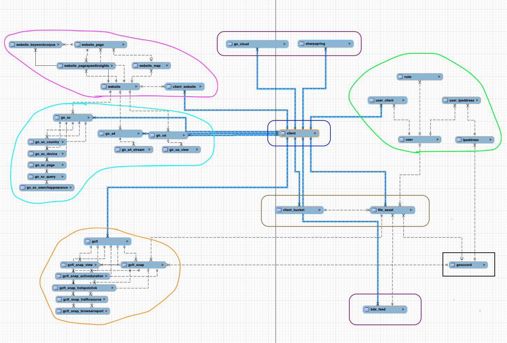

# GCAPI: Resource Data Models and Relationships

The GC Client Data Portal contains a number core data models with room to grow
and scale. Below is an outline of the resources available on the databse. Each
model shows the database schema, limitations, and relationship to other data
models.

## Schema Diagram



<dl>
    <dt>blue</dt>
    <dd>client-specific data:<br/>Client</dd>
    <dt>green</dt>
    <dd>user-specific data:
    <br/>User, Ipaddress, Note, UserIpaddress, UserClient</dd>
    <dt>violet</dt>
    <dd>third-party API key/connection data:
    <br/>GoogleCloud, Sharpspring, BDXFeed</dd>
    <dt>pink</dt>
    <dd>website data:
    <br/>Website, WebsiteMap, WebsitePage, WebsiteKeywordcorpus,
    WebsitePagespeedinsights, ClientWebsite</dd>
    <dt>indigo</dt>
    <dd>website analytics and search console data:
    <br/>GoogleSearchConsole, GSCCountry, GSCDevice, GSCPage, GSCQuery,
    GSCSearchappearance, GoogleAnalytics4, GA4Steam</dd>
    <dt>orange</dt>
    <dd>GC Fly Tours and GCFT analytics data:
    <br/>GCFlyTour, GCFTSnap, GCFTSnapView, GCFTSnapActiveduration,
    GCFTSnapHotspotclick, GCFTSnapTrafficsource, GCFTSnapBrowserreport</dd>
    <dt>brown</dt>
    <dd>AWS S3 bucket storage and file data:<br/>ClientBucket, FileAsset</dd>
    <dt>black</dt>
    <dd>application worker tasks/services:<br/>GeoCoord</dd>
</dl>

## Data Models

- [GCAPI: Resource Data Models and Relationships](#gcapi-resource-data-models-and-relationships)
  - [Schema Diagram](#schema-diagram)
  - [Data Models](#data-models)
    - [Base Model](#base-model)
    - [User](#user)
    - [Ipaddress](#ipaddress)
    - [User Ipaddress](#user-ipaddress)
    - [Note](#note)
    - [Client](#client)
    - [User Client](#user-client)
    - [Client Website](#client-website)
    - [Client Report](#client-report)
    - [Client Report Note](#client-report-note)
    - [Website](#website)
    - [Website Map](#website-map)
    - [Website Page](#website-page)
    - [Website Page Speed Insight](#website-page-speed-insight)
    - [Website Keyword Corpus](#website-keyword-corpus)
    - [Google Analytics 4](#google-analytics-4)
    - [Google Analytics 4: Stream](#google-analytics-4-stream)
    - [Google Search Console](#google-search-console)
    - [Google Search Console: Country, Device, Page, Query, SearchAppearance](#google-search-console-country-device-page-query-searchappearance)
    - [GC Fly Tour](#gc-fly-tour)
    - [GC Fly Tour Snap](#gc-fly-tour-snap)
      - [GC Fly Tour Snap: View](#gc-fly-tour-snap-view)
      - [GC Fly Tour Snap: Active Duration](#gc-fly-tour-snap-active-duration)
      - [GC Fly Tour Snap: Traffic Source](#gc-fly-tour-snap-traffic-source)
      - [GC Fly Tour Snap: Browser Report](#gc-fly-tour-snap-browser-report)
      - [GC Fly Tour Snap: Hotspot Click](#gc-fly-tour-snap-hotspot-click)
    - [GeoCoord](#geocoord)
    - [Sharpspring](#sharpspring)
    - [BDX Feed](#bdx-feed)
    - [Client Bucket](#client-bucket)
    - [File Asset](#file-asset)

----

### Base Model

```sql
    Table "gcapidb"."TABLE_NAME" {
    "id" CHAR(32) [not null]
    "created_on" DATETIME [not null, default: `now()`]
    "updated_on" DATETIME [not null, default: `now()`, onupdate: `now()`]

    Indexes {
        id [unique, name: "id_UNIQUE"]
    }
}
```

For the sake of being brief, all tables adopt the following base model. The
`id` field is the primary value used in lookups for any associated data models.
Some data models use the `id` as the primary key too.

----

### User

```sql
Table "gcapidb"."user" {
    "id" CHAR(32) [not null]
    "auth_id" VARCHAR(255) [pk, not null]
    "email" VARCHAR(320) [not null]
    "is_active" TINYINT(1) [not null, default: 1]
    "is_verified" TINYINT(1) [not null, default: 0]
    "is_superuser" TINYINT(1) [not null, default: 0]
    "roles" JSON [not null, default: "[\"user\"]"]

    Indexes {
        auth_id [unique, name: "auth_id_UNIQUE"]
        email [unique, name: "email_UNIQUE"]
    }
}
```

The `user` data model is essential in determining the privileges that users
have, and by extension what data they are authorized to access through the API.

Authentication will be handled by the **Auth0 database server** and therefore
our application database will not store any passwords. The application database
will only store information about the privileges granted to the user and minimal
personal info. NO credentials unique to the user will be stored on the
application database. The only personal information stored on the application
database is the email address and this field cannot be updated by any user.
The `auth_id` field is a unique identifier provided by the authentication
database and cannot be changed by any user.

The user privileges are predominantly controlled by the `role` field in the
database. The user data model includes a few flags: `is_active`, `is_verified`,
`is_superuser`.

- there is no API endpoint to *CREATE* a new user
  - only people with credentials to the Auth0 account may manually create
    a new user in the authentication database
- any user may register and login to the authentication database
  - all new users must verify their email address before they may login
- after a user is first authenticated, the API will *CREATE* the user in the
  application database
  - by default all new users are assigned the `role=user`
  - by default all new user have the flag `is_active=True`
  - by default all new user have the flag `is_verified=True`
  - by default all new user have the flag `is_superuser=False`

----

### Ipaddress

```sql
Table "gcapidb"."ipaddress" {
    "id" CHAR(32) [not null]
    "address" VARCHAR(40) [pk, not null]
    "isp" VARCHAR(255) [not null, default: "unknown"]
    "location" TEXT [not null, default: "unknown"]
    "geocoord_id" CHAR(32)

    Indexes {
        address [unique, name: "address_UNIQUE"]
        geocoord_id [name: "geocoord_id_idx"]
    }
}
```

The API will *CREATE* new ipaddress records as needed when a user logs in and
accesses the API endpoint from a new ipaddress.

- There are no *public* endpoints available for `ipaddress` data. Only users
  with `role=admin` may *READ* or *DELETE* this data.

----

### User Ipaddress

```sql
Table "gcapidb"."user_ipaddress" {
    "id" CHAR(32) [not null]
    "ipaddress_id" CHAR(32) [not null]
    "user_id" CHAR(32) [not null]

    Indexes {
        (ipaddress_id, user_id) [pk]
        user_id [name: "user_id_idx"]
        ipaddress_id [name: "ipaddress_id_idx"]
    }
}
```

This is the primary association table between `users` and `ipaddresses`, and
determines which users belong to which ipaddresses, and vice versa.

- There are no *public* endpoints available for `ipaddress` data. Only users
  with `role=admin` may *READ* or *DELETE* this data.

----

### Note

```sql
Table "gcapidb"."note" {
    "id" CHAR(32) [not null]
    "title" VARCHAR(96) [pk, not null]
    "description" TEXT(5000)
    "is_active" TINYINT(1) [not null, default: 1]
    "user_id" CHAR(32) [not null]

    Indexes {
        title [unique, name: "title_UNIQUE"]
        user_id [name: "user_id_idx"]
    }
}
```

Any logged in user may create a note. Notes belong to one specific user. Notes
are able to be associated with many other data models secondary association
tables, such as the `client_report_note` table which allows notes to be added
to specific client reports.

----

### Client

```sql
Table "gcapidb"."client" {
    "id" CHAR(32) [not null]
    "title" VARCHAR(96) [pk, not null]
    "description" TEXT(5000)
    "is_active" TINYINT(1) [not null, default: 1]

    Indexes {
        title [unique, name: "title_UNIQUE"]
    }
}
```

The client data model is the primary data model for the application. Many other
data models share a relationship with the client data model. For example, the
client data may be accessed by users that are associated with client data
through the `user_client` table.

----

### User Client

```sql
Table "gcapidb"."user_client" {
    "id" CHAR(32) [not null]
    "client_id" CHAR(32) [not null]
    "user_id" CHAR(32) [not null]

    Indexes {
        (client_id, user_id) [pk]
        id [unique, name: "id_UNIQUE"]
        client_id [name: "client_id_idx"]
        user_id [name: "user_id_idx"]
    }
}
```

This is the primary association table between `users` and `clients`, and
determines which users have access to which clients, and vice versa.

----

### Client Website

```sql
Table "gcapidb"."client_website" {
    "id" CHAR(32) [not null]
    "client_id" CHAR(32) [not null]
    "website_id" CHAR(32) [not null]

    Indexes {
        (client_id, website_id) [pk]
        id [unique, name: "id_UNIQUE"]
        website_id [name: "website_id_idx"]
        client_id [name: "client_id_idx"]
    }
}
```

- this is the primary association table between `clients` and the `websites`
  that belong to them

This is the primary association table between `clients` and `websites`, and
determines which websites belong to which clients, and vice versa.

----

### Client Report

```sql
Table "gcapidb"."client_report" {
    "id" CHAR(32) [not null]
    "title" VARCHAR(96) [pk, not null]
    "url" VARCHAR(2048) [not null]
    "description" TEXT(5000)
    "keys" BLOB

    Indexes {
        id [unique, name: "id_UNIQUE"]
        title [unique, name: "title_UNIQUE"]
    }
}
```

This is a data model for creating reports that may be shared with clients.
Client reports contain urls to a published report with a title, description,
and keys to easily search for reports.

----

### Client Report Note

```sql
Table "gcapidb"."client_report_note" {
    "id" CHAR(32) [not null]
    "client_report_id" CHAR(32) [not null]
    "note_id" CHAR(32) [not null]

    Indexes {
        (client_report_id, note_id) [pk]
        id [unique, name: "id_UNIQUE"]
        client_report_id [name: "client_report_id_idx1"]
        note_id [name: "note_id_idx"]
    }
}
```

This is the primary association table between `client_reports` and `notes`. It
allows users to create notes that are associated with specific client reports.

----

### Website

```sql
Table "gcapidb"."website" {
    "id" CHAR(32) [not null]
    "domain" VARCHAR(255) [pk, not null]
    "is_secure" TINYINT(1) [not null, default: 0]
    "is_active" TINYINT(1) [not null, default: 1]

    Indexes {
        id [unique, name: "id_UNIQUE"]
        domain [unique, name: "domain_UNIQUE"]
    }
}
```

Websites are another key data model for the application. Many other data models
are built around the website data model. A website mainly consists of a domain
name; we included a couple of useful flags to indicate whether the website is
running securely (TLS/SSL) and whether the website is active.

Website can have many website maps, and many website pages. Websites are
assocaited with clients through the `client_website` table.

----

### Website Map

```sql
Table "gcapidb"."website_map" {
    "id" CHAR(32) [pk, not null]
    "url" VARCHAR(2048) [not null]
    "is_active" TINYINT(1) [not null, default: 1]
    "website_id" CHAR(32) [not null]

    Indexes {
        id [unique, name: "id_UNIQUE"]
        website_id [name: "website_id_idx"]
    }
}
```

Website maps are links to the XML sitemap for a website. A website may have
many sitemaps used to index the pages of a website. The URL field should only
contain the page path to the `/sitemap.xml` file and exclude the domain name.

Sitemaps belong to one website and can have many pages associated with them.

----

### Website Page

```sql
Table "gcapidb"."website_page" {
    "id" CHAR(32) [pk, not null]
    "url" VARCHAR(2048) [not null]
    "status" INT [not null]
    "priority" FLOAT [not null]
    "last_modified" DATETIME
    "change_frequency" VARCHAR(64)
    "is_active" TINYINT(1) [not null, default: 1]
    "website_id" CHAR(32) [not null]
    "sitemap_id" CHAR(32)

    Indexes {
        id [unique, name: "id_UNIQUE"]
        website_id [name: "website_id_idx"]
        sitemap_id [name: "sitemap_id_idx"]
    }
}
```

Website pages are links to the individual pages of a website. The URL field
should only contain the page path and exclude the domain name. There are other
fields used to indicate the status of the page, the priority of the page, etc.

Website pages belong to one website and one sitemap. A website page may have
other page specific data associated with it, such as page speed insights and
keyword corpus data.

----

### Website Page Speed Insight

```sql
Table "gcapidb"."website_pagespeedinsights" {
    "id" CHAR(32) [pk, not null]
    "strategy" VARCHAR(16) [not null]
    "ps_weight" INT [not null, default: 100]
    "ps_grade" FLOAT [not null, default: 0]
    "ps_value" VARCHAR(4) [not null, default: "0%"]
    "ps_unit" VARCHAR(16) [not null, default: "percent"]
    "fcp_weight" INT [not null, default: 10]
    "fcp_grade" FLOAT [not null, default: 0]
    "fcp_value" FLOAT [not null, default: 0]
    "fcp_unit" VARCHAR(16) [not null, default: "miliseconds"]
    "lcp_weight" INT [not null, default: 25]
    "lcp_grade" FLOAT [not null, default: 0]
    "lcp_value" FLOAT [not null, default: 0]
    "lcp_unit" VARCHAR(16) [not null, default: "miliseconds"]
    "cls_weight" INT [not null, default: 15]
    "cls_grade" FLOAT [not null, default: 0]
    "cls_value" FLOAT [not null, default: 0]
    "cls_unit" VARCHAR(16) [not null, default: "unitless"]
    "si_weight" INT [not null, default: 10]
    "si_grade" FLOAT [not null, default: 0]
    "si_value" FLOAT [not null, default: 0]
    "si_unit" VARCHAR(16) [not null, default: "miliseconds"]
    "tbt_weight" INT [not null, default: 30]
    "tbt_grade" FLOAT [not null, default: 0]
    "tbt_value" FLOAT [not null, default: 0]
    "tbt_unit" VARCHAR(16) [not null, default: "miliseconds"]
    "website_id" CHAR(32) [not null]
    "page_id" CHAR(32) [not null]

    Indexes {
        id [unique, name: "id_UNIQUE"]
        website_id [name: "website_id_idx"]
        page_id [name: "page_id_idx"]
    }
}
```

Website page speed insights are data collected from the Google Page Speed
Insights and Core Web Vitals API. This data is collected for each page of a
website and the data is standardized by the [Google Developers Community](https://web.dev/).

Learn more about the Core Web Vitals metrics on the Web.Dev blog post on
[Core Web Vitals](https://web.dev/vitals/).

----

### Website Keyword Corpus

```sql
Table "gcapidb"."website_keywordcorpus" {
    "id" CHAR(32) [pk, not null]
    "corpus" LONGTEXT [not null]
    "rawtext" LONGTEXT [not null]
    "website_id" CHAR(32) [not null]
    "page_id" CHAR(32) [not null]

    Indexes {
        id [unique, name: "id_UNIQUE"]
        website_id [name: "website_id_idx"]
        page_id [name: "page_id_idx"]
    }
}
```

Website keyword corpus data is collected from a celery worker task that
scrapes the text content from each page of a website and processes the text
data into a machine learnable format. The data is then stored in the database
to later be processed by a machine learning model.

Keyword corpus data is used to determine the most relevant keywords for a
website and its pages and calculate the conguency between webpage keywords
and google searched keywords.

----

### Google Analytics 4

```sql
Table "gcapidb"."go_a4" {
    "id" CHAR(32) [not null]
    "title" VARCHAR(255) [not null]
    "measurement_id" CHAR(16) [pk, not null]
    "property_id" CHAR(16) [not null]
    "client_id" CHAR(32) [not null]
    "website_id" CHAR(32) [not null]

    Indexes {
        id [unique, name: "id_UNIQUE"]
        title [unique, name: "title_UNIQUE"]
        measurement_id [unique, name: "measurement_id_UNIQUE"]
        client_id [name: "client_id_idx"]
        website_id [name: "website_id_idx"]
    }
}
```

This is a simple data model for storing the Google Analytics 4 property data
that are associated with client websites. GA4 properties may have many streams
associated with them.

----

### Google Analytics 4: Stream

```sql
Table "gcapidb"."go_a4_stream" {
    "id" CHAR(32) [not null]
    "title" VARCHAR(255) [not null]
    "stream_id" CHAR(16) [pk, not null]
    "ga4_id" CHAR(32) [not null]

    Indexes {
        id [unique, name: "id_UNIQUE"]
        title [unique, name: "title_UNIQUE"]
        stream_id [unique, name: "stream_id_UNIQUE"]
        ga4_id [name: "ga4_id_idx"]
    }
}
```

Google Analaytics 4 Streams are unique streams of analytics data for GA4.
Streams are associated with individual GA4 properties.

----

### Google Search Console

```sql
Table "gcapidb"."go_sc" {
    "id" CHAR(32) [pk, not null]
    "title" VARCHAR(255) [not null]
    "client_id" CHAR(32) [not null]
    "website_id" CHAR(32) [not null]

    Indexes {
        id [unique, name: "id_UNIQUE"]
        title [unique, name: "title_UNIQUE"]
        client_id [name: "client_id_idx"]
        website_id [name: "website_id_idx"]
    }
}
```

This is a simple data model for storing the Google Search Console property data.
GSC properties are associated with a single website and a single client. GSC has
multiple data tables associated with it to track the different types of data
associated with a website's google search traffic.

----

### Google Search Console: Country, Device, Page, Query, SearchAppearance

```sql
Table "gcapidb"."go_sc_DATA_NAME" {
    "id" CHAR(32) [pk, not null]
    "keys" BLOB [not null]
    "clicks" INT [not null]
    "impressions" INT [not null]
    "ctr" FLOAT [not null]
    "position" FLOAT [not null]
    "date_start" DATETIME [not null]
    "date_end" DATETIME [not null]
    "gsc_id" CHAR(32) [not null]

    Indexes {
        id [unique, name: "id_UNIQUE"]
        gsc_id [name: "gsc_id_idx"]
    }
}
```

The Google Search Console API provides access to the following information
about users search traffic to a website:

1. `Countries` where people are located when they search for your website
2. `Devices` that people use when they search for your website
3. `Pages` of your website that people visit when they search for your website
4. `Queries` that people search for when they visit your website
5. `Search appearance` of your website in search results

There are 5 search console data tables in total which index data associated
with a single GSC property: `go_sc_country`, `go_sc_device`, `go_sc_page`,
`go_sc_query`, `go_sc_searchappearance`

----

### GC Fly Tour

```sql
Table "gcapidb"."gcft" {
    "id" CHAR(32) [not null]
    "group_name" VARCHAR(255) [not null]
    "group_slug" VARCHAR(12) [pk, not null]
    "client_id" CHAR(32) [not null]

    Indexes {
        id [unique, name: "id_UNIQUE"]
        client_id [name: "client_id_idx"]
    }
}
```

GC Fly Tours are a proprietary data model that is used to store data about
a 360 virtual reality tour built using our whitelabeled product. GC Fly Tours
data is modeled after the RAW CSV data exports we receive from our product on
a monthly basis.

One `GC Fly Tour` is associated with one client and consists of a group of
`GC Fly Tour Snaps`. These `GC Fly Tour` projects are identified by a unique
`group_slug` that is used to identify the project in the API; the `group_title`
is used to label the Client project.

----

### GC Fly Tour Snap

```sql
Table "gcapidb"."gcft_snap" {
    "id" CHAR(32) [not null]
    "snap_name" VARCHAR(255) [not null]
    "snap_slug" VARCHAR(12) [pk, not null]
    "altitude" INT
    "gcft_id" CHAR(32) [not null]
    "geocoord_id" CHAR(32) [not null]
    "file_asset_id" CHAR(32)

    Indexes {
        id [unique, name: "id_UNIQUE"]
        gcft_id [name: "gcft_id_idx"]
        file_asset_id [name: "file_asset_id_idx"]
        geocoord_id [name: "geocoord_id_idx"]
        snap_slug [unique, name: "snap_slug_UNIQUE"]
    }
}
```

Each GC Fly Tour snap is a single 360 virtual reality image that is associated
with a single `GC Fly Tour` project. The images are uploaded to the GCFT
Builder and assigned an immutable and unique `snap_slug` that is used to
identify the image in the API. The snap is also assigned to a unique
geo-location coordinate. Opptionally, the snap may be assigned an `file_asset`
that is uploaded to an AWS S3 bucket.

Each `GC Fly Tour Snap` is has many associated data models that are used to
track user interactions with the GC Fly Tour:

1. [Snap: View](#gc-fly-tour-snap-view)
2. [Snap: Active Duration](#gc-fly-tour-snap-active-duration)
3. [Snap: Traffic Source](#gc-fly-tour-snap-traffic-source)
4. [Snap: Browser Report](#gc-fly-tour-snap-browser-report)
5. [Snap: Hotspot Click](#gc-fly-tour-snap-hotspot-click)

----

#### GC Fly Tour Snap: View

```sql
Table "gcapidb"."gcft_snap_view" {
    "id" CHAR(32) [pk, not null]
    "session_id" CHAR(32) [not null]
    "view_date" DATETIME [not null]
    "gcft_id" CHAR(32) [not null]
    "snap_id" CHAR(32) [not null]

    Indexes {
        id [unique, name: "id_UNIQUE"]
        gcft_id [name: "gcft_id_idx"]
        snap_id [name: "snap_id_idx"]
    }
}
```

At the most basic level, a snap view tracks the `session_id` of a user that
that views the snap and the `view_date` and time that the user viewed the snap.
From this data we can track a number of metrics including:

- the number of times the snap is viewed
- the number of unique users that view the snap
- the number of times the snap is viewed by a unique user
- which snaps are viewed the most

----

#### GC Fly Tour Snap: Active Duration

```sql
Table "gcapidb"."gcft_snap_activeduration" {
    "id" CHAR(32) [pk, not null]
    "session_id" CHAR(32) [not null]
    "active_seconds" INT [not null]
    "visit_date" DATETIME [not null]
    "gcft_id" CHAR(32) [not null]
    "snap_id" CHAR(32) [not null]

    Indexes {
        id [unique, name: "id_UNIQUE"]
        gcft_id [name: "gcft_id_idx"]
        snap_id [name: "snap_id_idx"]
    }
}
```

On top of the snap view data, we also track the active duration of the
`session_id`. This data is used to track the amount of time that a user spends
actively viewing the snap on a particular `visit_date`. From this data we can
track a number of metrics including:

- the average amount of time that a snap is viewed
- the total amount of time that a snap is viewed
- how long a snap is viewed on average per user
- which snaps are viewed the longest

----

#### GC Fly Tour Snap: Traffic Source

```sql
Table "gcapidb"."gcft_snap_trafficsource" {
    "id" CHAR(32) [pk, not null]
    "session_id" CHAR(32) [not null]
    "referrer" VARCHAR(2048) [not null]
    "utm_campaign" VARCHAR(255)
    "utm_content" VARCHAR(255)
    "utm_medium" VARCHAR(255)
    "utm_source" VARCHAR(255)
    "utm_term" VARCHAR(255)
    "visit_date" DATETIME [not null]
    "gcft_id" CHAR(32) [not null]
    "snap_id" CHAR(32) [not null]

    Indexes {
        id [unique, name: "id_UNIQUE"]
        gcft_id [name: "gcft_id_idx"]
        snap_id [name: "snap_id_idx"]
    }
}
```

The traffic source data tracks the referral source of the `session_id` that
views the snap. When ever a GC Fly Tour is shared with a user, we strongly
recommend using UTM parameters to track the referral source of the user. This
allows us to track which referral traffic sources are most effective at
generating views of the GC Fly Tour.

----

#### GC Fly Tour Snap: Browser Report

```sql
Table "gcapidb"."gcft_snap_browserreport" {
    "id" CHAR(32) [pk, not null]
    "session_id" CHAR(32) [not null]
    "browser" VARCHAR(255)
    "browser_version" VARCHAR(255)
    "platform" VARCHAR(255)
    "platform_version" VARCHAR(255)
    "desktop" TINYINT(1)
    "tablet" TINYINT(1)
    "mobile" TINYINT(1)
    "city" VARCHAR(255)
    "country" VARCHAR(255)
    "state" VARCHAR(255)
    "language" VARCHAR(255)
    "visit_date" DATETIME [not null]
    "gcft_id" CHAR(32) [not null]
    "snap_id" CHAR(32) [not null]

    Indexes {
        id [unique, name: "id_UNIQUE"]
        gcft_id [name: "gcft_id_idx"]
        snap_id [name: "snap_id_idx"]
    }
}
```

The browser report data tracks the browser and platform information of the
`session_id` that views the snap. This data is used to track which browsers,
devices, and platforms are most commonly used to view the GC Fly Tour. It
also gathers information about the location of the user, including the city,
country, state, and language of the user.

----

#### GC Fly Tour Snap: Hotspot Click

```sql
Table "gcapidb"."gcft_snap_hotspotclick" {
    "id" CHAR(32) [pk, not null]
    "session_id" CHAR(32) [not null]
    "reporting_id" CHAR(32)
    "hotspot_type_name" VARCHAR(32)
    "hotspot_content" LONGTEXT
    "hotspot_icon_name" VARCHAR(255)
    "hotspot_name" VARCHAR(255)
    "hotspot_user_icon_name" VARCHAR(255)
    "linked_snap_name" VARCHAR(255)
    "snap_file_name" VARCHAR(255)
    "icon_color" VARCHAR(32)
    "bg_color" VARCHAR(32)
    "text_color" VARCHAR(32)
    "hotspot_update_date" DATETIME [not null]
    "click_date" DATETIME [not null]
    "gcft_id" CHAR(32) [not null]
    "snap_id" CHAR(32) [not null]

    Indexes {
        id [unique, name: "id_UNIQUE"]
        gcft_id [name: "gcft_id_idx"]
        snap_id [name: "snap_id_idx"]
    }
}
```

Users may view snaps and interact with the with 360 image by dragging their
mouse to view a different perspective of the image. Users may also click on
pieces of content embedded within the snap. Our GC Fly Tour platform tracks
all the interaction a user has with the snap. This data is used to generate
`hotspot` reports that track which pieces of content and areas of the snap
are most commonly interacted with.

----

### GeoCoord

```sql
Table "gcapidb"."geocoord" {
    "id" CHAR(32) [not null]
    "address" VARCHAR(255) [pk, not null]
    "latitude" FLOAT [not null]
    "longitude" FLOAT [not null]

    Indexes {
        id [unique, name: "id_UNIQUE"]
        address [unique, name: "address_UNIQUE"]
    }
}
```

Geo Coordinates are used to associate a specific latitude and longitude with
a specific address. Geo coordinate data may be associated with a couple of other
data models. For example some image types uploaded as `file_assets` may be given
a specific geo coordinate attached to the metadata of the image file.
Additionally, GCFT Snaps are required to have a geo-coordinate associated
with them because they are displayed on a map.

----

### Sharpspring

```sql
Table "gcapidb"."sharpspring" {
    "id" CHAR(32) [pk, not null]
    "hashed_api_key" VARCHAR(64) [not null]
    "hashed_secret_key" VARCHAR(64) [not null]
    "client_id" CHAR(32) [not null]

    Indexes {
        id [unique, name: "id_UNIQUE"]
        client_id [name: "client_id_idx"]
    }
}
```

This is a simple data model for storing the Sharpspring API credentials used to
authenticate with the Sharpspring API. The API credentials are encrypted.

----

### BDX Feed

```sql
Table "gcapidb"."bdx_feed" {
    "id" CHAR(32) [not null]
    "username" VARCHAR(255) [pk, not null]
    "password" VARCHAR(255) [not null]
    "serverhost" VARCHAR(255) [not null]
    "client_id" CHAR(32) [not null]

    Indexes {
        id [unique, name: "id_UNIQUE"]
        username [unique, name: "username_UNIQUE"]
    }
}
```

This is a simple data model for storing the BDX Feed API credentials used to
authenticate with the BDX API and fetch home builder data. The API credentials
are encrypted. Note data received from the BDX API is formated in XML.

----

### Client Bucket

```sql
Table "gcapidb"."client_bucket" {
    "id" CHAR(32) [not null]
    "description" TEXT(5000)
    "bucket_name" VARCHAR(100) [pk, not null]
    "object_key" VARCHAR(2048) [not null]
    "client_id" CHAR(32) [not null]

    Indexes {
        id [unique, name: "id_UNIQUE"]
        client_id [name: "client_id_idx"]
    }
}
```

This is a simple data model for storing the AWS S3 bucket details used to store
and fetch client data from the AWS S3 bucket.

----

### File Asset

```sql
Table "gcapidb"."file_asset" {
    "id" CHAR(32) [not null]
    "name" VARCHAR(96) [pk, not null]
    "extension" VARCHAR(255) [not null]
    "size_kb" INT [not null]
    "title" VARCHAR(96) [not null]
    "caption" VARCHAR(150)
    "keys" BLOB
    "is_private" TINYINT(1) [not null, default: 0]
    "user_id" CHAR(32) [not null]
    "bucket_id" CHAR(32) [not null]
    "client_id" CHAR(32) [not null]
    "geocoord_id" CHAR(32)
    "bdx_feed_id" CHAR(32)

    Indexes {
        id [unique, name: "id_UNIQUE"]
        name [unique, name: "name_UNIQUE"]
        user_id [name: "user_id_idx"]
        bucket_id [name: "bucket_id_idx"]
        client_id [name: "client_id_idx"]
        geocoord_id [name: "geocoord_id_idx"]
        bdx_feed_id [name: "bdx_feed_id_idx"]
    }
}
```

File assets are primarily associated with a `Client Bucket` and used to store
client data in an AWS S3 bucket. File assets may come in different formats and
types, such as images, videos, and documents. File assets may also be associated
other data models like `Geo Coordinate`, `GC Fly Tour Snap`, and `BDX Feed` files.

----
