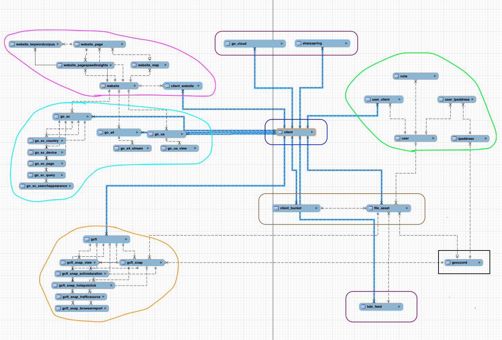

# GCAPI: Resource Data Models and Permissions

The GC Client Data Portal contains a few core data models with the ability to
grow and scale. Below is an outline of the data models and how they relate to
one another; it aims to answer the following questions for each:

- What data is being modeled?
- Where is the data stored?
- How should the data be formatted in its storage location
  - data type, size, and validation?
- Why is the data valuable or significant?
- Who has access to the data?
- When users create, read, update, or delete the data?

## Schema Diagram

<dl>
    <dt>blue</dt>
    <dd>client-specific data: Client</dd>
    <dt>green</dt>
    <dd>user-specific data:
     User, Ipaddress, Note, UserIpaddress, UserClient</dd>
    <dt>violet</dt>
    <dd>third-party API key/connection data:
     GoogleCloud, Sharpspring, BDXFeed</dd>
    <dt>pink</dt>
    <dd>website data:
     Website, WebsiteMap, WebsitePage, WebsiteKeywordcorpus,
    WebsitePagespeedinsights, ClientWebsite</dd>
    <dt>indigo</dt>
    <dd>website analytics and search console data:
     GoogleSearchConsole, GSCCountry, GSCDevice, GSCPage, GSCQuery,
    GSCSearchappearance, GoogleAnalytics4, GA4Steam, GoogleUniversalAnalytics,
    GUAView</dd>
    <dt>orange</dt>
    <dd>GC Fly Tours and GCFT analytics data:
     GCFlyTour, GCFTSnap, GCFTSnapView, GCFTSnapActiveduration,
    GCFTSnapHotspotclick, GCFTSnapTrafficsource, GCFTSnapBrowserreport</dd>
    <dt>brown</dt>
    <dd>AWS S3 bucket storage and file data: ClientBucket, FileAsset</dd>
    <dt>black</dt>
    <dd>application worker tasks/services: GeoCoord</dd>
</dl>

## Data Models

- [GCAPI: Resource Data Models and Permissions](#gcapi-resource-data-models-and-permissions)
  - [Schema Diagram](#schema-diagram)
  - [Data Models](#data-models)
    - [Base Model](#base-model)
    - [User](#user)
      - [Permission: User Me (i.e. Current User)](#permission-user-me-ie-current-user)
      - [Permission: List Users](#permission-list-users)
      - [Permission: Read User](#permission-read-user)
      - [Permission: Update User](#permission-update-user)
      - [Permission: Delete User](#permission-delete-user)
    - [Ipaddress](#ipaddress)
      - [Permission: L-CRUD Ipaddress](#permission-l-crud-ipaddress)
    - [User Ipaddress](#user-ipaddress)
    - [Note](#note)
      - [Permission: List Notes](#permission-list-notes)
      - [Permission: Create Note](#permission-create-note)
      - [Permission: Read Note](#permission-read-note)
      - [Permission: Update Note](#permission-update-note)
      - [Permission: Delete Note](#permission-delete-note)
    - [Client](#client)
      - [Permission: List Clients](#permission-list-clients)
      - [Permission: Create Client](#permission-create-client)
      - [Permission: Read Client](#permission-read-client)
      - [Permission: Update Client](#permission-update-client)
      - [Permission: Delete Client](#permission-delete-client)
    - [User Client](#user-client)
      - [Permission: List User Client](#permission-list-user-client)
      - [Permission: Create User Client](#permission-create-user-client)
      - [Permission: Read User Client](#permission-read-user-client)
      - [Permission: Delete User Client](#permission-delete-user-client)
    - [Client Website](#client-website)
      - [Permission: List Client Website](#permission-list-client-website)
      - [Permission: Create Client Website](#permission-create-client-website)
      - [Permission: Read Client Website](#permission-read-client-website)
      - [Permission: Delete Client Website](#permission-delete-client-website)
    - [Client Report](#client-report)
      - [Permission: List Client Report](#permission-list-client-report)
      - [Permission: Create Client Report](#permission-create-client-report)
      - [Permission: Read Client Report](#permission-read-client-report)
      - [Permission: Update Client Report](#permission-update-client-report)
      - [Permission: Delete Client Report](#permission-delete-client-report)
    - [Client Report Note](#client-report-note)
      - [Permission: List Client Report Note](#permission-list-client-report-note)
      - [Permission: Create Client Report Note](#permission-create-client-report-note)
      - [Permission: Read Client Report Note](#permission-read-client-report-note)
      - [Permission: Update Client Report Note](#permission-update-client-report-note)
      - [Permission: Delete Client Report Note](#permission-delete-client-report-note)
    - [Client Bucket](#client-bucket)
    - [File Asset](#file-asset)
    - [GeoCoord](#geocoord)
    - [Sharpspring](#sharpspring)
    - [BDX Feed](#bdx-feed)
    - [Website](#website)
      - [Permission: List Website](#permission-list-website)
      - [Permission: Create Website](#permission-create-website)
      - [Permission: Read Website](#permission-read-website)
      - [Permission: Update Website](#permission-update-website)
      - [Permission: Delete Website](#permission-delete-website)
    - [Website Map](#website-map)
      - [Permission: List Website Map](#permission-list-website-map)
      - [Permission: Create Website Map](#permission-create-website-map)
      - [Permission: Read Website Map](#permission-read-website-map)
      - [Permission: Update Website Map](#permission-update-website-map)
      - [Permission: Delete Website Map](#permission-delete-website-map)
    - [Website Page](#website-page)
      - [Permission: List Website Page](#permission-list-website-page)
      - [Permission: Create Website Page](#permission-create-website-page)
      - [Permission: Read Website Page](#permission-read-website-page)
      - [Permission: Update Website Page](#permission-update-website-page)
      - [Permission: Delete Website Page](#permission-delete-website-page)
    - [Website Page Speed Insight](#website-page-speed-insight)
      - [Permission: List Website Page Speed Insight](#permission-list-website-page-speed-insight)
      - [Permission: Create Website Page Speed Insight](#permission-create-website-page-speed-insight)
      - [Permission: Read Website Page Speed Insight](#permission-read-website-page-speed-insight)
      - [Permission: Update Website Page Speed Insight](#permission-update-website-page-speed-insight)
      - [Permission: Delete Website Page Speed Insight](#permission-delete-website-page-speed-insight)
    - [Website Keyword Corpus](#website-keyword-corpus)
      - [Permission: List Website Keyword Corpus](#permission-list-website-keyword-corpus)
      - [Permission: Create Website Keyword Corpus](#permission-create-website-keyword-corpus)
      - [Permission: Read Website Keyword Corpus](#permission-read-website-keyword-corpus)
      - [Permission: Update Website Keyword Corpus](#permission-update-website-keyword-corpus)
      - [Permission: Delete Website Keyword Corpus](#permission-delete-website-keyword-corpus)
    - [Google Analytics 4](#google-analytics-4)
      - [Permission: List Google Analytics 4 Property](#permission-list-google-analytics-4-property)
      - [Permission: Create Google Analytics 4 Property](#permission-create-google-analytics-4-property)
      - [Permission: Read Google Analytics 4 Property](#permission-read-google-analytics-4-property)
      - [Permission: Update Google Analytics 4 Property](#permission-update-google-analytics-4-property)
      - [Permission: Delete Google Analytics 4 Property](#permission-delete-google-analytics-4-property)
    - [Google Analytics 4: Stream](#google-analytics-4-stream)
      - [Permission: List Google Analytics 4 Steam](#permission-list-google-analytics-4-steam)
      - [Permission: Create Google Analytics 4 Steam](#permission-create-google-analytics-4-steam)
      - [Permission: Read Google Analytics 4 Steam](#permission-read-google-analytics-4-steam)
      - [Permission: Update Google Analytics 4 Steam](#permission-update-google-analytics-4-steam)
      - [Permission: Delete Google Analytics 4 Steam](#permission-delete-google-analytics-4-steam)
    - [Google Search Console](#google-search-console)
      - [Permission: List Google Search Console](#permission-list-google-search-console)
      - [Permission: Create Google Search Console](#permission-create-google-search-console)
      - [Permission: Read Google Search Console](#permission-read-google-search-console)
      - [Permission: Update Google Search Console](#permission-update-google-search-console)
      - [Permission: Delete Google Search Console](#permission-delete-google-search-console)
    - [Google Search Console: Country, Device, Page, Query, SearchAppearance](#google-search-console-country-device-page-query-searchappearance)
    - [GC Fly Tour](#gc-fly-tour)
      - [Permission: List GC Fly Tour](#permission-list-gc-fly-tour)
      - [Permission: Create GC Fly Tour](#permission-create-gc-fly-tour)
      - [Permission: Read GC Fly Tour](#permission-read-gc-fly-tour)
      - [Permission: Update GC Fly Tour](#permission-update-gc-fly-tour)
      - [Permission: Delete GC Fly Tour](#permission-delete-gc-fly-tour)
    - [GC Fly Tour Snap](#gc-fly-tour-snap)
      - [Permission: List GC Fly Tour Snap](#permission-list-gc-fly-tour-snap)
      - [Permission: Create GC Fly Tour Snap](#permission-create-gc-fly-tour-snap)
      - [Permission: Read GC Fly Tour Snap](#permission-read-gc-fly-tour-snap)
      - [Permission: Update GC Fly Tour Snap](#permission-update-gc-fly-tour-snap)
      - [Permission: Delete GC Fly Tour Snap](#permission-delete-gc-fly-tour-snap)
    - [GC Fly Tour Snap: Active Duration](#gc-fly-tour-snap-active-duration)
      - [Permission: List GC Fly Tour Snap Active Duration](#permission-list-gc-fly-tour-snap-active-duration)
      - [Permission: Create GC Fly Tour Snap Active Duration](#permission-create-gc-fly-tour-snap-active-duration)
      - [Permission: Read GC Fly Tour Snap Active Duration](#permission-read-gc-fly-tour-snap-active-duration)
      - [Permission: Update GC Fly Tour Snap Active Duration](#permission-update-gc-fly-tour-snap-active-duration)
      - [Permission: Delete GC Fly Tour Snap Active Duration](#permission-delete-gc-fly-tour-snap-active-duration)
    - [GC Fly Tour Snap: Browser Report](#gc-fly-tour-snap-browser-report)
      - [Permission: List GC Fly Tour Snap Browser Report](#permission-list-gc-fly-tour-snap-browser-report)
      - [Permission: Create GC Fly Tour Snap Browser Report](#permission-create-gc-fly-tour-snap-browser-report)
      - [Permission: Read GC Fly Tour Snap Browser Report](#permission-read-gc-fly-tour-snap-browser-report)
      - [Permission: Update GC Fly Tour Snap Browser Report](#permission-update-gc-fly-tour-snap-browser-report)
      - [Permission: Delete GC Fly Tour Snap Browser Report](#permission-delete-gc-fly-tour-snap-browser-report)
    - [GC Fly Tour Snap: Hotspot Click](#gc-fly-tour-snap-hotspot-click)
      - [Permission: List GC Fly Tour Snap Hotspot Click](#permission-list-gc-fly-tour-snap-hotspot-click)
      - [Permission: Create GC Fly Tour Snap Hotspot Click](#permission-create-gc-fly-tour-snap-hotspot-click)
      - [Permission: Read GC Fly Tour Snap Hotspot Click](#permission-read-gc-fly-tour-snap-hotspot-click)
      - [Permission: Update GC Fly Tour Snap Hotspot Click](#permission-update-gc-fly-tour-snap-hotspot-click)
      - [Permission: Delete GC Fly Tour Snap Hotspot Click](#permission-delete-gc-fly-tour-snap-hotspot-click)
    - [GC Fly Tour Snap: Traffic Source](#gc-fly-tour-snap-traffic-source)
      - [Permission: List GC Fly Tour Snap Traffic Source](#permission-list-gc-fly-tour-snap-traffic-source)
      - [Permission: Create GC Fly Tour Snap Traffic Source](#permission-create-gc-fly-tour-snap-traffic-source)
      - [Permission: Read GC Fly Tour Snap Traffic Source](#permission-read-gc-fly-tour-snap-traffic-source)
      - [Permission: Update GC Fly Tour Snap Traffic Source](#permission-update-gc-fly-tour-snap-traffic-source)
      - [Permission: Delete GC Fly Tour Snap Traffic Source](#permission-delete-gc-fly-tour-snap-traffic-source)
    - [GC Fly Tour Snap: View](#gc-fly-tour-snap-view)
      - [Permission: List GC Fly Tour Snap View](#permission-list-gc-fly-tour-snap-view)
      - [Permission: Create GC Fly Tour Snap View](#permission-create-gc-fly-tour-snap-view)
      - [Permission: Read GC Fly Tour Snap View](#permission-read-gc-fly-tour-snap-view)
      - [Permission: Update GC Fly Tour Snap View](#permission-update-gc-fly-tour-snap-view)
      - [Permission: Delete GC Fly Tour Snap View](#permission-delete-gc-fly-tour-snap-view)

----

### Base Model

    Table "gcapidb"."TABLE_NAME" {
        "id" CHAR(32) [not null]
        "created_on" DATETIME [not null, default: `now()`]
        "updated_on" DATETIME [not null, default: `now()`, onupdate: `now()`]

        Indexes {
            id [unique, name: "id_UNIQUE"]
        }
    }

For the sake of being brief, all tables adopt the following base model. The
“id” field is the primary value used in lookups for any associated data models.

----

### User

    Table "gcapidb"."user" {
        "auth_id" VARCHAR(255) [pk, not null]
        "email" VARCHAR(320) [not null]
        "is_active" TINYINT(1) [not null, default: 1]
        "is_verified" TINYINT(1) [not null, default: 0]
        "is_superuser" TINYINT(1) [not null, default: 0]
        "roles" JSON [not null, default: "[\"user\"]"]

        Indexes {
            auth_id [unique, name: "auth_id_UNIQUE"]
            email [unique, name: "email_UNIQUE"]
        }
    }

The `user` data model is essential in determining the privileges that users have,
and by extension what data they are authorized to access through the API.

As described in the previous sections, the Authentication will be handled by
the **Auth0 database server** and therefore our application database will not
store any passwords. The application database will only store information about
the privileges granted to the user and minimal personal info. NO credentials
unique to the user will be stored on the application database. The only personal
information stored on the application database is the email address and this
field cannot be updated by any user. The `auth_id` field is a unique identifier
provided by the authentication database and cannot be changed by any user.

The user privileges are predominantly controlled by the role field in the
database. The user data model includes a few flags: `is_active`, `is_verified`,
`is_superuser`.

#### Permission: User Me (i.e. Current User)

- there is no API endpoint to *CREATE* a new user
  - only people with credentials to the Auth0 account may manually create
    a new user in the authentication database
- any user may register and login to the authentication database
  - all new users must verify their email address before they may login
- after a user’s first authenticated, application will *CREATE* the user in
  the application database
  - by default all new users are assigned the `role=user`
  - by default all new user have the flag `is_active=True`
  - by default all new user have the flag `is_verified=False`
  - by default all new user have the flag `is_superuser=False`

#### Permission: List Users

- only users with `role=admin` may *LIST* all users
- only users with `role=manager` may *LIST* users with `role=client|employee`

#### Permission: Read User

- a user may *READ* their own user data
- a user may *READ* certain privilege flags depending on the user’s role
  - `role=admin` may see all flags, including `is_superuser`
  - `role=manager`|client|employee may only see `is_active` and `is_verified`

#### Permission: Update User

- a user may *UPDATE* limited fields of their own data
  - a user may *UPDATE* their flag `is_verified=True` by validating a
  verification token provided through an email
  - a user may have their flag `is_verified` *UPDATE*, if the Auth0
  authentication database provides an alternate value
- users with `role=manager` may *UPDATE* the:
  - role of other users with `role=client`|employee|user,
    but not to `role=admin`
  - flags of users with `role=client|employee|user`,
    but cannot set the flag `is_superuser=True`
- only users with `role=admin` may *UPDATE* user privileges without restriction
  - assign any user the `role=admin`
  - update any flag of any user
- only one user may have flag `is_superuser=True` (the admin 👑 of admin ⚔️)
  - only user with flag `is_superuser` may relinquish their administrative-admin
    role to one other user in the application database

#### Permission: Delete User

- only users with `role=admin` may *DELETE* users

----

### Ipaddress

    Table "gcapidb"."ipaddress" {
        "address" VARCHAR(40) [pk, not null]
        "isp" VARCHAR(255) [not null, default: "unknown"]
        "location" TEXT [not null, default: "unknown"]
        "geocoord_id" CHAR(32)

        Indexes {
            address [unique, name: "address_UNIQUE"]
            geocoord_id [name: "geocoord_id_idx"]
        }
    }

#### Permission: L-CRUD Ipaddress

- There are no *public* endpoints available to list, create, read, update,
  or delete `ipaddress` data.
- Only users with `role=admin` may *READ* or *DELETE* this data.
- The API will *CREATE* new ipaddress records as needed when a user logs in and
  accesses the /users/me endpoint from a new ipaddress.

----

### User Ipaddress

    Table "gcapidb"."user_ipaddress" {
        "ipaddress_id" CHAR(32) [not null]
        "user_id" CHAR(32) [not null]

        Indexes {
            (ipaddress_id, user_id) [pk]
            id [unique, name: "id_UNIQUE"]
            user_id [name: "user_id_idx"]
            ipaddress_id [name: "ipaddress_id_idx"]
        }
    }

- this is the primary association table between `users` and `ipaddresses`, and
  determines which users belong to which ipaddresses, and vice versa
- there are no *public* endpoints available to *LIST*, *CREATE*, *READ*,
  *UPDATE*, or *DELETE* `user_ipaddress` data
- only users with `role=admin` may *READ* or *DELETE* this data
- the api uses a CRUD interface to manage these records as needed, such as when
  a user logs in and accesses the /users/me endpoint from a new ipaddress

----

### Note

    Table "gcapidb"."note" {
        "title" VARCHAR(96) [pk, not null]
        "description" TEXT(5000)
        "user_id" CHAR(32) [not null]

        Indexes {
            title [unique, name: "title_UNIQUE"]
            user_id [name: "user_id_idx"]
        }
    }

#### Permission: List Notes

- users with `role=admin|manager` may *LIST* all notes
- users with `role=client|employee` may *LIST* only notes that they created
  and notes that are associated with their client
- users with `role=user` may *LIST* only notes that they created

#### Permission: Create Note

- any user may *CREATE* a new note
  - notes are assigned to one user

#### Permission: Read Note

- any user may *READ* their own notes
- users with `role=manager` may *READ* notes of users with
  `role=client|employee`
- only users with `role=admin` may *READ* notes of any users

#### Permission: Update Note

- any user may *UPDATE* their own notes
- only users with `role=admin` may *UPDATE* notes of any users

#### Permission: Delete Note

- any user may *DELETE* their own notes
- users with `role=manager` may *DELETE* notes of users with
  `role=client|employee`
- only users with `role=admin` may *DELETE* notes of any users

----

### Client

    Table "gcapidb"."client" {
        "title" VARCHAR(96) [pk, not null]
        "description" TEXT(5000)
        "is_active" TINYINT(1) [not null, default: 1]

        Indexes {
            title [unique, name: "title_UNIQUE"]
        }
    }

#### Permission: List Clients

- users with `role=admin|manager` may *LIST* all clients
- users with `role=client|employee` may only *LIST* clients that are associated
  with their client

#### Permission: Create Client

- users with `role=admin|manager` may *CREATE* a new clients

#### Permission: Read Client

- users with `role=admin|manager` may read any client
- users may read a client if they are associated with the client through
  the `user_client` table

#### Permission: Update Client

- users with `role=admin|manager` may *UPDATE* any client

#### Permission: Delete Client

- only users with `role=admin` may *DELETE* any client

----

### User Client

    Table "gcapidb"."user_client" {
        "client_id" CHAR(32) [not null]
        "user_id" CHAR(32) [not null]

        Indexes {
            (client_id, user_id) [pk]
            client_id [name: "client_id_idx"]
            user_id [name: "user_id_idx"]
        }
    }

- this is the primary association table between `users` and `clients`, and
  determines which users have access to which clients, and vice versa

#### Permission: List User Client

- users with `role=admin|manager` may *LIST* all `user_client` associations

#### Permission: Create User Client

- assigns a `user` to a `client`
- users with `role=admin|manager` may *CREATE* a new `user_client` association

#### Permission: Read User Client

- users with `role=admin|manager` may *READ* any `user_client` association

#### Permission: Delete User Client

- users with `role=admin|manager` may *DELETE* any `user_client` association

----

### Client Website

    Table "gcapidb"."client_website" {
        "client_id" CHAR(32) [not null]
        "website_id" CHAR(32) [not null]

        Indexes {
        (client_id, website_id) [pk]
            website_id [name: "website_id_idx"]
            client_id [name: "client_id_idx"]
        }
    }

- this is the primary association table between `clients` and the `websites`
  that belong to them

#### Permission: List Client Website

- users with `role=admin|manager` may *LIST* all `client_website` associations
- users with `role=client|employee` may *LIST* only `client_website`
  associations that are associated with clients that they are associated with

#### Permission: Create Client Website

- users with `role=admin|manager` may *CREATE* a new `client_website`
  association

#### Permission: Read Client Website

- users with `role=admin|manager` may *READ* any `client_website` association
- users with `role=client|employee` may *READ* only `client_website`
  associations that are associated with clients that they are associated with

#### Permission: Delete Client Website

- users with `role=admin|manager` may *DELETE* any `client_website`
  association

----

### Client Report

    Table "gcapidb"."client_report" {
        "title" VARCHAR(96) [pk, not null]
        "url" VARCHAR(2048) [not null]
        "description" TEXT(5000)
        "keys" BLOB

        Indexes {
            title [unique, name: "title_UNIQUE"]
        }
    }

#### Permission: List Client Report

- users with `role=admin|manager` may *LIST* all client reports
- users with `role=client|employee` may *LIST* only client reports that are
  associated with clients that they are associated with

#### Permission: Create Client Report

- users with `role=admin|manager|employee` may *CREATE* a new client report

#### Permission: Read Client Report

- users with `role=admin|manager` may *READ* any client report
- users with `role=client|employee` may *READ* only client reports that are
  associated with clients that they are associated with

#### Permission: Update Client Report

- users with `role=admin|manager|employee` may *UPDATE* any client report

#### Permission: Delete Client Report

- users with `role=admin|manager` may *DELETE* any client report

----

### Client Report Note

    Table "gcapidb"."client_report_note" {
        "client_report_id" CHAR(32) [not null]
        "note_id" CHAR(32) [not null]

        Indexes {
            (client_report_id, note_id) [pk]
            client_report_id [name: "client_report_id_idx1"]
            note_id [name: "note_id_idx"]
        }
    }

#### Permission: List Client Report Note

#### Permission: Create Client Report Note

#### Permission: Read Client Report Note

#### Permission: Update Client Report Note

#### Permission: Delete Client Report Note

----

### Client Bucket

    Table "gcapidb"."client_bucket" {
        "description" TEXT(5000)
        "bucket_name" VARCHAR(100) [pk, not null]
        "object_key" VARCHAR(2048) [not null]
        "client_id" CHAR(32) [not null]

        Indexes {
            client_id [name: "client_id_idx"]
        }
    }

----

### File Asset

    Table "gcapidb"."file_asset" {
        "name" VARCHAR(96) [pk, not null]
        "extension" VARCHAR(255) [not null]
        "size_kb" INT [not null]
        "title" VARCHAR(96) [not null]
        "caption" VARCHAR(150)
        "keys" BLOB
        "is_private" TINYINT(1) [not null, default: 0]
        "user_id" CHAR(32) [not null]
        "bucket_id" CHAR(32) [not null]
        "client_id" CHAR(32) [not null]
        "geocoord_id" CHAR(32)
        "bdx_feed_id" CHAR(32)

        Indexes {
            name [unique, name: "name_UNIQUE"]
            user_id [name: "user_id_idx"]
            bucket_id [name: "bucket_id_idx"]
            client_id [name: "client_id_idx"]
            geocoord_id [name: "geocoord_id_idx"]
            bdx_feed_id [name: "bdx_feed_id_idx"]
        }
    }

----

### GeoCoord

    Table "gcapidb"."geocoord" {
        "address" VARCHAR(255) [pk, not null]
        "latitude" FLOAT [not null]
        "longitude" FLOAT [not null]

        Indexes {
            address [unique, name: "address_UNIQUE"]
        }
    }

----

### Sharpspring

    Table "gcapidb"."sharpspring" {
        "hashed_api_key" VARCHAR(64) [not null]
        "hashed_secret_key" VARCHAR(64) [not null]
        "client_id" CHAR(32) [not null]

        Indexes {
            client_id [name: "client_id_idx"]
        }
    }

----

### BDX Feed

    Table "gcapidb"."bdx_feed" {
        "username" VARCHAR(255) [pk, not null]
        "password" VARCHAR(255) [not null]
        "serverhost" VARCHAR(255) [not null]
        "client_id" CHAR(32) [not null]

        Indexes {
            username [unique, name: "username_UNIQUE"]
        }
    }

----

### Website

    Table "gcapidb"."website" {
        "domain" VARCHAR(255) [pk, not null]
        "is_secure" TINYINT(1) [not null, default: 0]

        Indexes {
            domain [unique, name: "domain_UNIQUE"]
        }
    }

#### Permission: List Website

#### Permission: Create Website

#### Permission: Read Website

#### Permission: Update Website

#### Permission: Delete Website

----

### Website Map

    Table "gcapidb"."website_map" {
        "url" VARCHAR(2048) [not null]
        "website_id" CHAR(32) [not null]

        Indexes {
            website_id [name: "website_id_idx"]
        }
    }

#### Permission: List Website Map

#### Permission: Create Website Map

#### Permission: Read Website Map

#### Permission: Update Website Map

#### Permission: Delete Website Map

----

### Website Page

    Table "gcapidb"."website_page" {
        "url" VARCHAR(2048) [not null]
        "status" INT [not null]
        "priority" FLOAT [not null]
        "last_modified" DATETIME
        "change_frequency" VARCHAR(64)
        "website_id" CHAR(32) [not null]
        "sitemap_id" CHAR(32)

        Indexes {
            website_id [name: "website_id_idx"]
            sitemap_id [name: "sitemap_id_idx"]
        }
    }

#### Permission: List Website Page

#### Permission: Create Website Page

#### Permission: Read Website Page

#### Permission: Update Website Page

#### Permission: Delete Website Page

----

### Website Page Speed Insight

    Table "gcapidb"."website_pagespeedinsights" {
        "strategy" VARCHAR(16) [not null]
        "ps_weight" INT [not null, default: 100]
        "ps_grade" FLOAT [not null, default: 0]
        "ps_value" VARCHAR(4) [not null, default: "0%"]
        "ps_unit" VARCHAR(16) [not null, default: "percent"]
        "fcp_weight" INT [not null, default: 10]
        "fcp_grade" FLOAT [not null, default: 0]
        "fcp_value" FLOAT [not null, default: 0]
        "fcp_unit" VARCHAR(16) [not null, default: "miliseconds"]
        "lcp_weight" INT [not null, default: 25]
        "lcp_grade" FLOAT [not null, default: 0]
        "lcp_value" FLOAT [not null, default: 0]
        "lcp_unit" VARCHAR(16) [not null, default: "miliseconds"]
        "cls_weight" INT [not null, default: 15]
        "cls_grade" FLOAT [not null, default: 0]
        "cls_value" FLOAT [not null, default: 0]
        "cls_unit" VARCHAR(16) [not null, default: "unitless"]
        "si_weight" INT [not null, default: 10]
        "si_grade" FLOAT [not null, default: 0]
        "si_value" FLOAT [not null, default: 0]
        "si_unit" VARCHAR(16) [not null, default: "miliseconds"]
        "tbt_weight" INT [not null, default: 30]
        "tbt_grade" FLOAT [not null, default: 0]
        "tbt_value" FLOAT [not null, default: 0]
        "tbt_unit" VARCHAR(16) [not null, default: "miliseconds"]
        "website_id" CHAR(32) [not null]
        "page_id" CHAR(32) [not null]

        Indexes {
            website_id [name: "website_id_idx"]
            page_id [name: "page_id_idx"]
        }
    }

#### Permission: List Website Page Speed Insight

#### Permission: Create Website Page Speed Insight

#### Permission: Read Website Page Speed Insight

#### Permission: Update Website Page Speed Insight

#### Permission: Delete Website Page Speed Insight

----

### Website Keyword Corpus

    Table "gcapidb"."website_keywordcorpus" {
        "corpus" LONGTEXT [not null]
        "rawtext" LONGTEXT [not null]
        "website_id" CHAR(32) [not null]
        "page_id" CHAR(32) [not null]

        Indexes {
            website_id [name: "website_id_idx"]
            page_id [name: "page_id_idx"]
        }
    }

#### Permission: List Website Keyword Corpus

#### Permission: Create Website Keyword Corpus

#### Permission: Read Website Keyword Corpus

#### Permission: Update Website Keyword Corpus

#### Permission: Delete Website Keyword Corpus

----

### Google Analytics 4

    Table "gcapidb"."go_a4" {
        "title" VARCHAR(255) [not null]
        "measurement_id" CHAR(16) [pk, not null]
        "property_id" CHAR(16) [not null]
        "client_id" CHAR(32) [not null]
        "website_id" CHAR(32) [not null]

        Indexes {
            title [unique, name: "title_UNIQUE"]
            measurement_id [unique, name: "measurement_id_UNIQUE"]
            client_id [name: "client_id_idx"]
            website_id [name: "website_id_idx"]
        }
    }

#### Permission: List Google Analytics 4 Property

#### Permission: Create Google Analytics 4 Property

#### Permission: Read Google Analytics 4 Property

#### Permission: Update Google Analytics 4 Property

#### Permission: Delete Google Analytics 4 Property

----

### Google Analytics 4: Stream

    Table "gcapidb"."go_a4_stream" {
        "title" VARCHAR(255) [not null]
        "stream_id" CHAR(16) [pk, not null]
        "ga4_id" CHAR(32) [not null]

        Indexes {
            title [unique, name: "title_UNIQUE"]
            stream_id [unique, name: "stream_id_UNIQUE"]
            ga4_id [name: "ga4_id_idx"]
        }
    }

#### Permission: List Google Analytics 4 Steam

#### Permission: Create Google Analytics 4 Steam

#### Permission: Read Google Analytics 4 Steam

#### Permission: Update Google Analytics 4 Steam

#### Permission: Delete Google Analytics 4 Steam

----

### Google Search Console

    Table "gcapidb"."go_sc" {
        "title" VARCHAR(255) [not null]
        "client_id" CHAR(32) [not null]
        "website_id" CHAR(32) [not null]

        Indexes {
            title [unique, name: "title_UNIQUE"]
            client_id [name: "client_id_idx"]
            website_id [name: "website_id_idx"]
        }
    }

#### Permission: List Google Search Console

#### Permission: Create Google Search Console

#### Permission: Read Google Search Console

#### Permission: Update Google Search Console

#### Permission: Delete Google Search Console

----

### Google Search Console: Country, Device, Page, Query, SearchAppearance

    Table "gcapidb"."go_sc_DATA_NAME" {
        "keys" BLOB [not null]
        "clicks" INT [not null]
        "impressions" INT [not null]
        "ctr" FLOAT [not null]
        "position" FLOAT [not null]
        "date_start" DATETIME [not null]
        "date_end" DATETIME [not null]
        "gsc_id" CHAR(32) [not null]

        Indexes {
            id [unique, name: "id_UNIQUE"]
            gsc_id [name: "gsc_id_idx"]
        }
    }

----

### GC Fly Tour

    Table "gcapidb"."gcft" {
        "group_name" VARCHAR(255) [not null]
        "group_slug" VARCHAR(12) [pk, not null]
        "client_id" CHAR(32) [not null]

        Indexes {
            client_id [name: "client_id_idx"]
        }
    }

#### Permission: List GC Fly Tour

#### Permission: Create GC Fly Tour

#### Permission: Read GC Fly Tour

#### Permission: Update GC Fly Tour

#### Permission: Delete GC Fly Tour

----

### GC Fly Tour Snap

    Table "gcapidb"."gcft_snap" {
        "snap_name" VARCHAR(255) [not null]
        "snap_slug" VARCHAR(12) [pk, not null]
        "altitude" INT
        "gcft_id" CHAR(32) [not null]
        "image_id" CHAR(32) [not null]
        "geocoord_id" CHAR(32) [not null]

        Indexes {
            gcft_id [name: "gcft_id_idx"]
            image_id [name: "image_id_idx"]
            geocoord_id [name: "geocoord_id_idx"]
            snap_slug [unique, name: "snap_slug_UNIQUE"]
        }
    }

#### Permission: List GC Fly Tour Snap

#### Permission: Create GC Fly Tour Snap

#### Permission: Read GC Fly Tour Snap

#### Permission: Update GC Fly Tour Snap

#### Permission: Delete GC Fly Tour Snap

----

### GC Fly Tour Snap: Active Duration

    Table "gcapidb"."gcft_snap_activeduration" {
        "session_id" CHAR(32) [not null]
        "active_seconds" INT [not null]
        "visit_date" DATETIME [not null]
        "gcft_id" CHAR(32) [not null]
        "snap_id" CHAR(32) [not null]

        Indexes {
            gcft_id [name: "gcft_id_idx"]
            snap_id [name: "snap_id_idx"]
        }
    }

#### Permission: List GC Fly Tour Snap Active Duration

#### Permission: Create GC Fly Tour Snap Active Duration

#### Permission: Read GC Fly Tour Snap Active Duration

#### Permission: Update GC Fly Tour Snap Active Duration

#### Permission: Delete GC Fly Tour Snap Active Duration

----

### GC Fly Tour Snap: Browser Report

    Table "gcapidb"."gcft_snap_browserreport" {
        "session_id" CHAR(32) [not null]
        "browser" VARCHAR(255)
        "browser_version" VARCHAR(255)
        "platform" VARCHAR(255)
        "platform_version" VARCHAR(255)
        "desktop" TINYINT(1)
        "tablet" TINYINT(1)
        "mobile" TINYINT(1)
        "city" VARCHAR(255)
        "country" VARCHAR(255)
        "state" VARCHAR(255)
        "language" VARCHAR(255)
        "visit_date" DATETIME [not null]
        "gcft_id" CHAR(32) [not null]
        "snap_id" CHAR(32) [not null]

        Indexes {
            gcft_id [name: "gcft_id_idx"]
            snap_id [name: "snap_id_idx"]
        }
    }

#### Permission: List GC Fly Tour Snap Browser Report

#### Permission: Create GC Fly Tour Snap Browser Report

#### Permission: Read GC Fly Tour Snap Browser Report

#### Permission: Update GC Fly Tour Snap Browser Report

#### Permission: Delete GC Fly Tour Snap Browser Report

----

### GC Fly Tour Snap: Hotspot Click

    Table "gcapidb"."gcft_snap_hotspotclick" {
        "session_id" CHAR(32) [not null]
        "reporting_id" CHAR(32)
        "hotspot_type_name" VARCHAR(32)
        "hotspot_content" LONGTEXT
        "hotspot_icon_name" VARCHAR(255)
        "hotspot_name" VARCHAR(255)
        "hotspot_user_icon_name" VARCHAR(255)
        "linked_snap_name" VARCHAR(255)
        "snap_file_name" VARCHAR(255)
        "icon_color" VARCHAR(32)
        "bg_color" VARCHAR(32)
        "text_color" VARCHAR(32)
        "hotspot_update_date" DATETIME [not null]
        "click_date" DATETIME [not null]
        "gcft_id" CHAR(32) [not null]
        "snap_id" CHAR(32) [not null]

        Indexes {
            gcft_id [name: "gcft_id_idx"]
            snap_id [name: "snap_id_idx"]
        }
    }

#### Permission: List GC Fly Tour Snap Hotspot Click

#### Permission: Create GC Fly Tour Snap Hotspot Click

#### Permission: Read GC Fly Tour Snap Hotspot Click

#### Permission: Update GC Fly Tour Snap Hotspot Click

#### Permission: Delete GC Fly Tour Snap Hotspot Click

----

### GC Fly Tour Snap: Traffic Source

    Table "gcapidb"."gcft_snap_trafficsource" {
        "session_id" CHAR(32) [not null]
        "referrer" VARCHAR(2048) [not null]
        "utm_campaign" VARCHAR(255)
        "utm_content" VARCHAR(255)
        "utm_medium" VARCHAR(255)
        "utm_source" VARCHAR(255)
        "utm_term" VARCHAR(255)
        "visit_date" DATETIME [not null]
        "gcft_id" CHAR(32) [not null]
        "snap_id" CHAR(32) [not null]

        Indexes {
            gcft_id [name: "gcft_id_idx"]
            snap_id [name: "snap_id_idx"]
        }
    }

#### Permission: List GC Fly Tour Snap Traffic Source

#### Permission: Create GC Fly Tour Snap Traffic Source

#### Permission: Read GC Fly Tour Snap Traffic Source

#### Permission: Update GC Fly Tour Snap Traffic Source

#### Permission: Delete GC Fly Tour Snap Traffic Source

----

### GC Fly Tour Snap: View

    Table "gcapidb"."gcft_snap_view" {
        "session_id" CHAR(32) [not null]
        "view_date" DATETIME [not null]
        "gcft_id" CHAR(32) [not null]
        "snap_id" CHAR(32) [not null]

        Indexes {
            gcft_id [name: "gcft_id_idx"]
            snap_id [name: "snap_id_idx"]
        }
    }

#### Permission: List GC Fly Tour Snap View

#### Permission: Create GC Fly Tour Snap View

#### Permission: Read GC Fly Tour Snap View

#### Permission: Update GC Fly Tour Snap View

#### Permission: Delete GC Fly Tour Snap View

----
